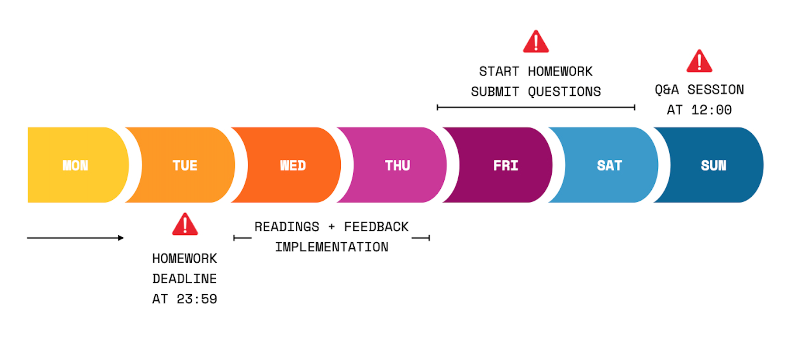

> If you are following the HackYourFuture curriculum, we recommend you to start from module 1: [HTML/CSS/GIT](https://github.com/HackYourFuture/HTML-CSS). To get a complete overview of the HackYourFuture curriculum first, click [here](https://github.com/HackYourFuture/curriculum).

> Please help us improve and share your feedback! If you find better tutorials or links, please share them by [opening a pull request](https://github.com/HackYourFuture/React/pulls).

# Module #7 - React.js: Building dynamic UIs with modern JavaScript (Frontend)


Welcome to the React module! Congratulations on making it this far!

In these four weeks, we will go back to the frontend and learn how to make faster, more modern user interfaces. In the HTML and JavaScript modules, you've learned all about creating webpages that hold unchanging data. No matter who is using the website, the data will always be the same. We call this a `static website`. At the same time you've build various HTML pages so the user is able to access various parts of the website. We call this a `multi-page application (MPA)`.

In the Node.js module, you've learned about how to change the content of the page, based on the user's input, using a `templating engine`. Type in a keyword and the server sends back a `template` with customized data. We call this a `dynamic website`. However, we did it in such a way were we still had to send different pages to the client depending on the URL (for example, `/` or `/users`). This is also an MPA.

In this module, however, you'll learn how to make more complex websites. Though we won't be calling them websites anymore: they'll be `web applications`. They're not just informational, but allow the user to interact with it. This similar to any application on your desktop. These React applications will also deal with `dynamic data`: its `state` changes depending on who's using it.

Besides being dynamic, React applications also are `single page applications (SPA)`. Essentially, this means that on loading the whole application (every page and its contents) is accessible to the user, without the need to send requests to the server to get another page.

## Before you start

In order to properly work through this module smoothly, we're going to use software that will allow us to write React applications with ease. It's called `create-react-app`.

Go to your command line and execute the following:

```bash
npm install -g create-react-app
```

Now verify that you have it by executing the following:

```bash
create-react-app --version
```

It should be at least version `2.1.x`.

## Learning goals

In order to successfully complete this module you will need to master the following:

- Understand the React way of thinking about `user interfaces`;
- Know the importance and place of `state` and how to pass it down;
- Be able to work with different `hooks` and even create your own;
- Recognize the utility of `modularization`;
- Putting emphasis on writing reusable code (`components`);
- How to handle `client-side routing`.

## How to use this repository

### Repository content

This repository consists of 3 essential parts:

1. `README`: this document contains all the required theory you need to understand **while** working on the assignment. It contains not only the right resources to learn about the concepts, but also lectures done by HackYourFuture teachers. This is the **first thing** you should start with every week.
2. `MAKEME`: this document contains the instructions for each week's assignment. Start with the exercises rather quickly, so that you can ground the concepts you read about earlier.
3. `LESSONPLAN`: this document is meant for teachers as a reference. However, as a trainee don't be shy to take a look at it as well!

### How to study

Let's say you are just starting out with the Databases module. This is what you do:

1. The week always starts on **Wednesday**. First thing you'll do is open the `README.md` for that week. For the first week of `Databases`, that would be [Week1 Reading](/Week1/README.md).
2. You spend **Wednesday** and **Thursday** going over the resources and try to get a basic understanding of the concepts. In the meanwhile, you'll also implement any feedback you got on last week's assignment (from the Node.js module).
3. On **Friday** you start with the assignment, found in the `MAKEME.md`. For the first week of `React`, that would be [Week1 assignment](/week1/MAKEME.md).
4. You spend **Friday** and **Saturday** playing around with the exercises and write down any questions you might have.
5. **DEADLINE 1**: You'll submit any questions you might have before **Saturday 23.59**, in the class channel.
6. On **Sunday** you'll attend class. It'll be of the Q&A format, meaning that there will be no new material. Instead your questions shall be discussed and you can learn from others.
7. You spend **Monday** and **Tuesday** finalizing your assignment.
8. **DEADLINE 2**: You submit your assignment to the right channels (GitHub) before **Tuesday 23.59**. If you can't make it on time, please communicate it with your mentor.
9. Start the new week by going back to point 1!

In summary:



To have a more detailed overview of the guidelines, please read [this document](https://docs.google.com/document/d/1JUaEbxMQTyljAPFsWIbbLwwvvIXZ0VCHmCCN8RaeVIc/edit?usp=sharing) or ask your mentor/cohort on Slack!

## Planning

| Week | Topics                                                  | Reading Materials                | Assignment                         |
| ---- | ------------------------------------------------------- | -------------------------------- | -------------------------------- |
| 1.   | What is React, JSX, State & Props, Deploy a static site | [Readings W1](./week1/README.md) | [Assignment W1](./week1/MAKEME.md) |
| 2.   | API calls, Testing                                      | [Readings W2](./week2/README.md) | [Assignment W2](./week2/MAKEME.md) |
| 3.   | Client-side routing, Context, Custom hooks              | [Readings W3](./week3/README.md) | [Assignment W3](./week3/MAKEME.md) |
| 4.   | Project!                                                | [Readings W4](./week4/README.md) |                                  |

## Finished?

Did you finish the module? Impressive!

If you feel ready for the **final** challenge, click [here](https://www.github.com/HackYourFuture/Project) to go to project! _Note that reviewing the feedback on your previous assignments remains the priority._

_The HackYourFuture curriculum is subject to CC BY copyright. This means you can freely use our materials, but just make sure to give us credit for it :)_

<a rel="license" href="http://creativecommons.org/licenses/by/4.0/"></a><br />This work is licensed under a <a rel="license" href="http://creativecommons.org/licenses/by/4.0/">Creative Commons Attribution 4.0 International License</a>.
