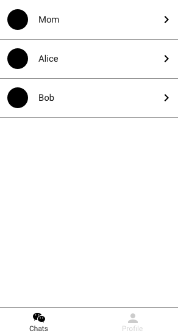
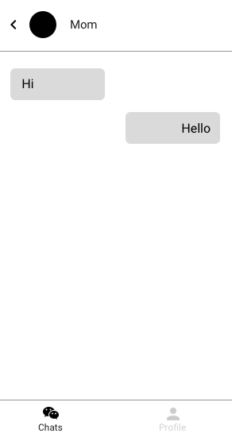
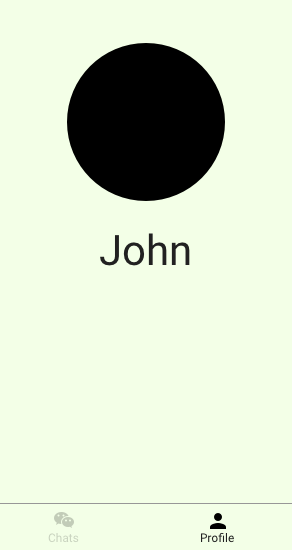

# Chat app

## Outline

Imagine a chat app:

With the following component hierarchy:

## Components

Review the list of components, their state and their props:

| Component | Props | State |
| --------- | ----- | ----- |
| `App` | &lt;None&gt; | <ul><li>`chats`</li><li>`profile`</li></ul> |
| `ChatsScreen` | <ul><li>`chats`</li></ul> | &lt;None&gt; |
| `ChatItem` | <ul><li>`chat`</li></ul> | &lt;None&gt; |
| `ChatScreen` | <ul><li>`chat`</li></ul> | &lt;None&gt; |
| `Message` | <ul><li>`message`</li></ul> | &lt;None&gt; |
| `ProfileScreen` | <ul><li>`profile`</li></ul> | &lt;None&gt; |
| `Avatar` | <ul><li>`profile`</li></ul> | &lt;None&gt; |
| `ProfileName` | <ul><li>`profile`</li></ul> | &lt;None&gt; |
