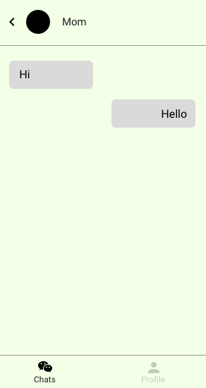

# Chat app

## Outline

Imagine a chat app:





With the following component hierarchy:


## Components

Review the list of components, their state and their props:

### `App`

#### Props

&lt;None&gt;

#### State

- `chats` (`array<chat>`):  all chats
- `profile` (`<profile>`): the user's profile

### `ChatsScreen`

#### Props

- `chats` (`array<chat>`): all chats

#### State

&lt;None&gt;

### `ChatItem`

#### Props

- `chat` (`<chat>`): the chat to display in the item

#### State

&lt;None&gt;

### `ChatScreen`

#### Props

- `chat` (`<chat>`): the chat to display in the screen

#### State

&lt;None&gt;

### `Message`

#### Props

- `message` (`<message>`): the message to display

#### State

&lt;None&gt;

### `ProfileScreen`

#### Props

- `profile` (`<profile>`): the user's profile

#### State

&lt;None&gt;

### `Avatar`

#### Props

- `profile` (`<profile>`): the user's profile

#### State

&lt;None&gt;

### `ProfileName`

#### Props

- `profile` (`<profile>`): the user's profile

#### State

&lt;None&gt;

## Data structure

The following lists the structure of the data:

### `profile`

```js
{
  "name":      <string>,
  "avatarURL": <string>
]
```

### `chat`

```js
{
  "id":       <number>,
  "contact":  <contact>,
  "messages": [<message>, <message>, ...]
}
```

### `contact`

```js
{
  "id":        <number>,
  "name":      <string>,
  "avatarURL": <string>
}
```

### `message`

```js
{
  "id":     <number>,
  "fromMe": <boolean>,
  "date":   <string / date>,
  "text":   <contact>,
  "read":   <boolean>
}
```
