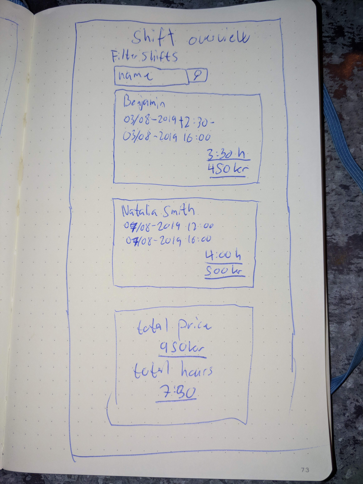

# Lesson Plan - Advanced React

## Forms
Forms works out of the box exactly like plain html.

but if we need to handle form submission in javascript and keep track of what data the user enters in the form, then we use [controlled inputs](#controlled-inputs)

### Controlled Inputs
  - Docs [here](https://reactjs.org/docs/forms.html#controlled-components)
  - Uncontrolled inputs are almost never useful to us
  - For controlled inputs, we must provide _both_:
    - The value
    - The onChange event handler
  - React controls the state of the input, not the browser
### Using data fetching
  - Setting up fetching on mount
### Prop types
### Children
  - Make a simple example of using `props.children`. Fx the fancyborder component used in [this example](https://reactjs.org/docs/composition-vs-inheritance.html#containment)

[Code inspiration](#random-cats)

## Flipped classroom videos

[Flipped classroom videos](./preparation.md#flipped-classroom-videos)

## Code inspiration

### Random cats

```js
import React, { useEffect, useState } from 'react';
import "./catStyles.css"

function FancyBorder(props) {
  return <div className='fancy-border'>{props.children}</div>;
}

export function RandomCats({ fetchUrl }) {
  const [randomCats, setRandomCats] = useState([]);
  useEffect(() => {
    addCat();
  }, []);

  const getCat = () => {
    return fetch(fetchUrl).then((response) => response.json());
  };

  const addCat = () => {
    getCat().then((cat) => {
      setRandomCats((prev) => [...prev, cat.file]);
    });
  };

  const randomCatsDisplay = randomCats.map((randomCat) => {
    return (
      <li>
        <FancyBorder>
          
        </FancyBorder>
      </li>
    );
  });

  return (
    <div className='App'>
      <h1>Random cats</h1>
      <button onClick={addCat}>Add cat</button>
      <ul>
        {randomCatsDisplay}
      </ul>
    </div>
  );
}
```

## Exercise

1. Create a CatListItem component which has has a CatItem and a DeleteCatItem component.
The randomCatsDisplay now looks like this:
```js
  const randomCatsDisplay = randomCats.map((randomCat) => {
      return (
        <CatListItem randomCat={randomCat} deleteCat={deleteCat}></CatListItem>
      );
    });
```
When the delete button is clicked the cat is deleted.

2. Place the CatItem and the DeleteCatItem inside the FancyBorder component and add some styling

### Time registration
Make a site that manages time registration for employees.

#### User stories

##### Submit shift
As a employee i would like to submit my shift. The shift should include
- Employee name
- Start time
- End time

##### Shift overview
As an employeer i would like to have an overview of the employee shifts. They should be displayed in a list, showing
- Employee name
- Start time
- End time
- Total number of hours
- Price for shift

##### Total price
As an employeer i would like to have an overview of the total logged time and the total price for that time.

##### Filter submitted shifts
As an employeer i would like to filter the shifts based on name.

#### Technical details

All components should have prop types defined.

##### Submit shift
The submit shift form should come up as a modal. The simplest way to do this is setting the modal to fixed position.

Use controlled inputs to get the shift information.

Pressing save will add the shift to the shifts overview.

What input type should `start` and `end` be?

##### Shift overview
To fetch the default shifts, use this api: https://gist.githubusercontent.com/benna100/5fd674171ea528d7cd1d504e9bb0ca6f/raw

When is it we should do fetching in a React component?

Remember loading state when fetching the default shifts.

The shift components should be wrapped in a border component that adds a border to the component being wrapped. Do this using `props.children`.

##### Filter submitted shifts
Do this again using controlled inputs.


#### Mockups

##### Submit shift


##### Shifts overview

