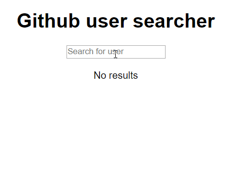

# Homework

## Get git ready to work on homework

Using the `hyf-homework` repo. In the terminal run `git status`

If there are changes that have not been committed, figure out what to do with those changes

- Should they be committed to another branch?
- Should they be committed to `main`?
- Should they be discarded?

When you have figured out what to do with the changes and fixed those. Write `git status` again. If it says `nothing to commit, working tree clean`. Then you are ready to create the branch for this weeks homework.

### Creating the branch

Using the `hyf-homework` repo write this command

`git checkout main` - You are now on the `main` branch

`git checkout -b react-react2-week1`

This will create and checkout the branch so you are ready make commits to it

[This video](https://www.youtube.com/watch?v=XYlgh9hSWtw) can help. On slack use the #git-support channel to ask questions about git

## Github users search

your homework will be searching github users based on the what you type in the input. Use this api: `https://api.github.com/search/users?q=${query}`

Requirements:

- When the search is loading, you should show "loading..."
- When the search is failed, you should show "error fetching (reason why it failed)..."
- When the search result is empty (no users), you should show "No results..."
- All state should be managed using the context api!

Try the website here: https://ro6ne.csb.app/

## Working with github api

- Continue using the github API through this url - https://api.github.com (Hint: use postman to query the github API)
- By querying the above url you will view all the api urls that the github API has. You can try to explore them, we recommend that you read the github API documentation. (https://developer.github.com/v3/#current-version)
  - You can try to retrieve the repos data from the HackYourFuture-CPH organisation - (Hint: https://api.github.com/users/.../repos)
  - You can try to display the name of all the repos in your React app
  - If this is to easy for you... surprise us with your creativity... build up on your project and we will have a look!! ;)

 

## Hand in homework

Need to brush up on the homework hand-in process? 
Check [this resource](https://github.com/HackYourFuture-CPH/Git/blob/main/homework_hand_in.md) to remember how to hand in the homework correctly!
