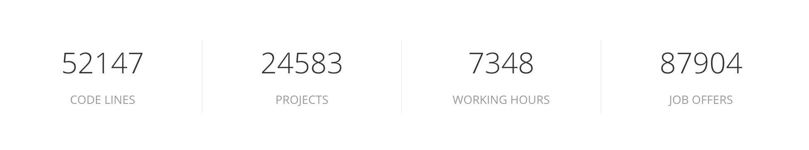
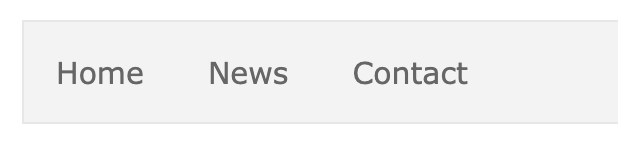
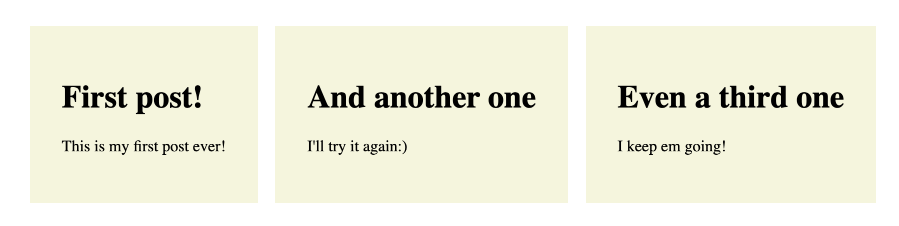

# Lesson Plan Week 1

## Agenda

The purpose of this class is to introduce the trainee to the most basic React concepts:

-   How to look at a `webpage` from the React point of view
-   What `create-react-app` is
-   How to write `reusable components` and why
-   The purpose of `JSX`
-   What are `props` and how to `pass them down components`
-   What is `state`?

When illustrating these concepts, make use of [create-react-app](https://github.com/facebook/create-react-app). Make sure that trainees have installed it as well.

_Explain to trainees what each library does: React, ReactDOM and Babel._

## Core concepts

## 1. Looking at webpages from the React point of view

### Explanation

React aims to build webpages, by breaking the page down into small pieces: components. These components are isolated bits of HTML that can receive changing data in order to be reusable for different purposes. In this way you could say that components are custom HTML elements.

These components are structured similar to the DOM: in a tree-like structure. The top-level element contains the component that has the rest of the application nested inside of it.

### Example

Take a look the following example:



This is made using one single component (reused several times):

```jsx
const Stat = ({ statNum, statDesc }) => {
	return (
		<div>
			<span>{statNum}</span>
			<span>{statDesc}</span>
		</div>
	);
};
```

By instantiating it several times you can output it like in the image:

```jsx
<>
	<Stat statNum={'52147'} statDesc={'CODE LINES'} />
	<Stat statNum={'24583'} statDesc={'PROJECTS'} />
	<Stat statNum={'7348'} statDesc={'WORKING HOURS'} />
	<Stat statNum={'87904'} statDesc={'JOB OFFERS'} />
</>
```

### Exercise

Show this [example](https://htmlstream.com/preview/unify-v2.6.2/unify-main/home/home-default.html) and dissect a part of the site into components. After, ask 2 trainees to do the same.

### Essence

Using React allows us to make webpages using reusable building blocks: components. That saves us time and effort in the longterm!

## 2. create-react-app

### Explanation

In order to quickly start building React applications, we can use a tool called `create-react-app`. It's an NPM package that sets up a basic template project, incorporating tools needed for us to translate React code into regular JavaScript the browser can understand.

These tools are `webpack` (which bundles and optimizes our component files into one) and `babel` (which transforms our modern JavaScript into an older version most browsers will understand).

To set this up manually will be time costly, therefore we can make things easy by using `create-react-app`.

### Example

_Install `create-react-app` and create a sample project. Go over the various files and explain what their purpose is._

### Exercise

Ask trainees to install `create-react-app` and get it started on their machines!

### Essence

`create-react-app` allows us to:

-   Generate an fully functional out-of-the-box React environment
-   Solve problem of manually configuring file bundler (like Webpack) or transpiler (Babel)
-   Improve our development workflow through `hot reloading`
-   Give a more realistic folder structure
-   Build a production version of react app and deploying on static site hosting service (netlify/now)

## 3. Components

### Explanation

A component is a part of a webpage. It contains 2 things: (1) the necessary HTML to structure the element and (2) the necessary JavaScript to give it dynamic data.

### Example

In the React world you'll find 2 types of components: `class`-based and `function`-based.

```jsx
// Class based component (Old way)
class Counter {
	state = {
		count: 0,
	};

	render() {
		return <div>{this.state.count}</div>;
	}
}
```

```jsx
// Function based component (New way)
const ThisIsAComponent = () => {
	const [count, setCount] = useState(0);

	return <div>{setCount}</div>;
};
```

You should focus on `function` based components.

### Exercise

Ask trainees to rebuild the following:



-   The components should be `functional`
-   Make 2 components `NavBar` and `NavBarItem`
-   Pass props to each `NavBarItem` instance
-   Styling is optional

After they're done discuss and highlight the works of at least 2 trainees.

### Essence

Components are:

-   Custom HTML elements: reusable building blocks used to create webpages.
-   Designed to receive different data in each instance.
-   Able to display JavaScript values using the `{ }` symbols.
-   Always returning HTML-like elements, which is called JSX

## 4. JSX

### Explanation

`JSX` stands for JavaScript XML. Effectively, it's our ability to return HTML elements in our React components.

### Example

```jsx
const Section = () => {
	return (
		<section>
			<h1>The section component</h1>
			<p>In this component we return HTML. In the React world we call this JSX!</p>
		</section>
	);
};
```

### Exercise

Ask trainees to create a functional component that returns the following HTML elements:

-   1 `<nav>`
-   1 `<ul>`
-   2 `<li>`: t

### Essence

-   A way to write dynamic HTML code with JavaScript
-   It is a more intuitive version of the function `createElement()` (that takes its name from the DOM function `createElement()`)
-   A component should always return JSX
-   These are the parts that will build the DOM structure

_Show example of both JSX and createElement component and ask trainees to do the same._

## 5. Props

### Explanation

`Props` is short for `property`: like the ones you give an HTML element. However, in React we can make up our own property names for the components we create.

With `props` we can pass down information from one level of the component tree into another, lower level.

In this way we can give each component instance different data. We can access this data from that instance using the `prop` name.

### Example

```jsx
const UserItem = ({ name }) => {
	return <li>{name}</li>
}

const UserList = () => {
	return (
		<ul>
			<UserItem name={"Wouter"}>
			<UserItem name={"Federico"}>
			<UserItem name={"Noer"}>
		</ul>
	)
}
```

### Exercise

Ask trainees to make a **list of posts**, where each post has a `title` and a `content` part. It should look like similar to this:



Requirements:

-   Create a functional component called `PostList`, that will store 3 posts
-   Create a functional component called `Post`, that will take 2 props: `title` and `content`
-   Styling is optional

### Essence

`Props` are:

-   used to pass down data from component to component.
-   are custom named HTML properties.
-   making it possible for our components to be reusable

## 6. Forms

### Explanation

In HTML, forms have a default behavior. They store the data and automically want to refresh the page. In React we're trying to stop this default behavior and bring the data under our control: by putting it into `state`!

We bring form data into state by listening to it, using the `onChange` and `value` attribute. We are controlling our `<input>` fields, thereby creating `controlled inputs`. Then when we want to submit it, we can use the `onSubmit` attribute.

### Example

```jsx
const Form = () => {
	const [formValues, setFormValues] = useState({ title: '' });

	const inputHandler = (event) => {
		setFormValues();
	};

	return (
		<form onSubmit={}>
			<input type="text" onChange={inputHandler} value={formValues.title} />
		</form>
	);
};
```

### Exercise


### Essence


## 7. What is state?

### Explanation

State is all the data in the application, that can change because of user interaction. It's defined using a special React function, called `useState`.

This `useState` function provides the state value, and a function that allows us to modify the state value.

All state values must be declared at the top function, ideally in the parent component.

Whenever we want to pass a state value down into a component, we assign it to a custom named `prop`. It can then be accessed as part of the `props` within that child component.

### Example

```jsx
const Counter = () => {
	// State value, state modifier, initial state
	const [count, setCount] = useState(0);

	// Handler to change state
	const handleClick = () => {
		setCount((prevState) => prevState + 1);
	};

	return (
		<div>
			<Count count={count} />
			<button onClick={handleClick}>+ 1</button>
		</div>
	);
};

const Count = ({ count }) => {
	return <p>Count is: {count}</p>;
};
```

### Exercise

Ask trainees to remake aforementioned by themselves.

### Essence

Having state allows our application to handle 'dynamic data': data that can change. Using the React defined `useState` function we can define and modify all pieces of state that need to change
