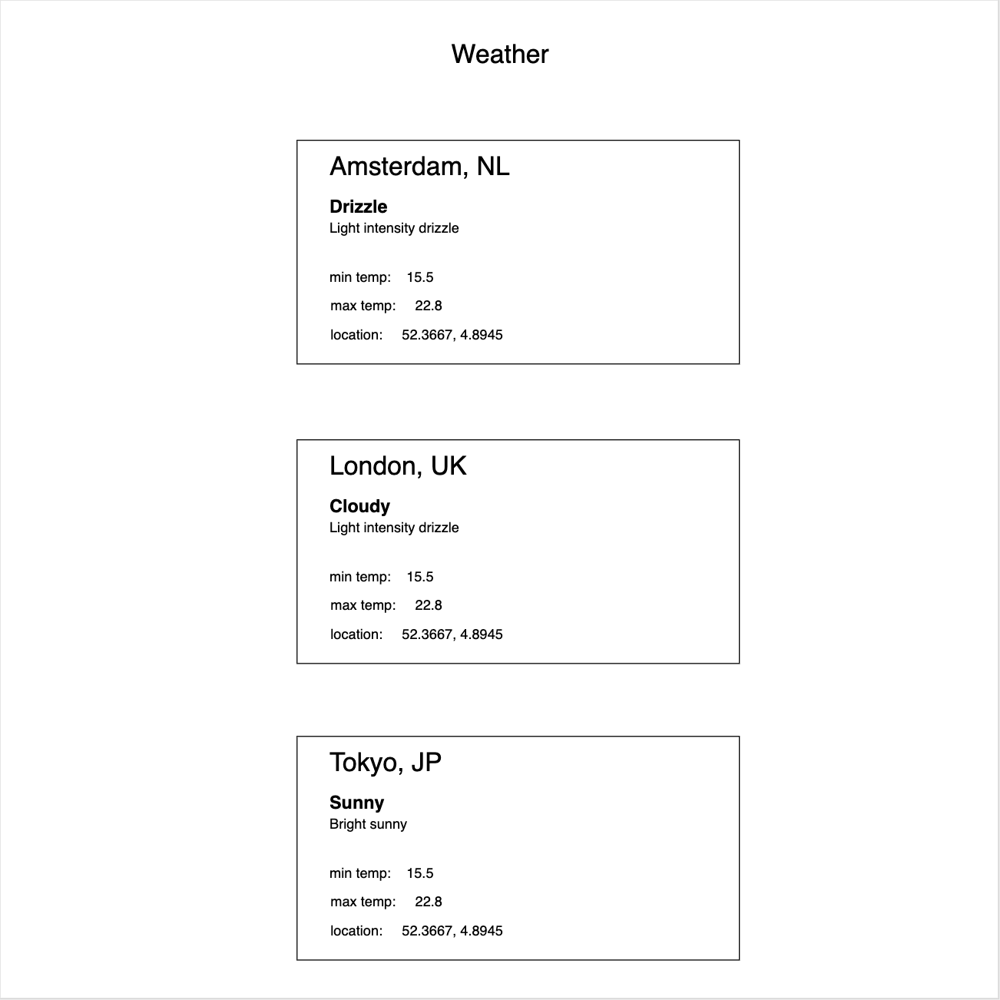

# Homework React Week 1

## **Todo list**

1. Practice the concepts
2. React exercises
3. Code along
4. PROJECT: Hack Your Weather I

## **1. Practice the concepts**

Let's get started with some interactive exercises! Complete the exercises from the following resources:

- [Codecademy: Learn ReactJS I](https://www.codecademy.com/learn/react-101)

## **2. React exercises**

> Inside of your `React` fork, go to the `week1` folder and create a React application called `react-exercises` (use `create-react-app`). Inside of the `src` folder create a JavaScript file with an appropriate name.

**Exercise 1: Extreme hobbies**

There's nothing better than some extreme sports to get the blood pumping.

Take a look at the following:

```js
const hobbies = ["Surfing", "Rock climbing", "Mountain biking", "Breakdancing"];
```

1. Create 2 functional components: `<HobbyList>` and `<Hobbies>`
2. Put the `hobbies` variable into the `<HobbyList>` component as state.
3. In the `return` statement of the `<HobbyList>` use the `map()` function to return an instance of `<Hobby>`
4. Pass down the hobby as a `prop`
5. Test out if it works by importing it into the top level component, which in this case is `<App>`

**Exercise 2: Perfect customer service!**

Don't you love it when a company provides great customer service?

Take a look at the following image:


In this exercise you have to create a single component that you'll reuse to display different information each time.

1. Create a functional component called `<Guarantee>`
2. Instantiate it 3 times
3. Give each component 3 `props`: an `img`, `title` and `description`
4. Pass down to each component the appropriate content. Take the images from the **assets** folder, inside the **exercise1** folder
5. Test out if it works by importing it into the top level component, which is `<App>`

**Exercise 3: It's higher than 10!**

Let's create a simple number counter, starting from 0 until infinity!

1. Create 3 functional components called `<Counter>`, `<Count>` and `<Button>`
2. Inside `<Counter>` define a state variable called `count` (initialized with value `0`) and state handler called `setCount`
3. Inside `<Button>` create a `<button>` with the text `Add 1!` and `onClick` attribute
4. Pass down the `count` state variable to `<Count>`, and the `setCount` to `<Button>`
5. Inside `<Counter>`, declare a variable called `feedback` above the return statement. Give this variable a ternary operator value: if `count` is higher than 10 it should display the string `"It's higher than 10!"`, else it displays `"Keep counting..."`
6. 5. Test out if it works by importing `<Counter>` into the top level component, which is `<App>`

## **3. Code along**

Learning how to work with React is a fundamentally different approach to building frontends. Therefore, we need to practice a lot!

In the following tutorial you'll learn how to a `Random Quote Machine`!

Notice how you'll be writing `class` based components. This is an older React feature for writing components, but that's still valid.

Even though you'll be learning more modern ways of writing React applications, you should always be aware that applications can vary in the versions of technologies they're working with.

Don't worry! You don't have to memorize it all. Aim for understanding the principle behind it to the best you can. If you ever feel in doubt: do a Google search or ask a question in Slack!

Enjoy!

- [Build a Random Quote Machine](https://www.youtube.com/playlist?list=PL3cz80ehFCan4srLIp1HmhrQ0CU8Cw9XM)

## **4. PROJECT: Hack Your Weather I**

> Before you start, create a new folder called `project` that includes the files for the following web application you'll be building.

During this module you'll be starting a project called `Hack Your Weather`! Like in the Node.js module, each week you'll add to it until it becomes a fully-fledged application you can be proud of.

Here's what you're eventually going end up with: [Hack Your Weather Finished](https://hyf-weather-app.netlify.com/)

Let's get into it.

### 1. Setup

The first step to any project is to setup your development environment. Follow the steps:

1. Navigate to your `project` folder
2. Inside, use `create-react-app` to create a React application. Give it the name `hackyourweather`
3. Copy and paste the file `city-weather.json` (you can find this inside of the `project-starter-files` folder) inside of your project folder: into the `src` folder

### 2. Requirements

This week you'll build the foundation of your application. It should eventually look like this:



Here are the requirements your project needs to fulfill:

- List all the cities and their weather information (taken from `city-weather.json`)
- Display each city in its own box
- Each box should contain the following pieces of data:
  - `city name`
  - `country name`
  - `weather main`
  - `weather desciption`
  - `max and min temprature`
  - `location (longitude and lattitude)`
- Deploy your static site using [Netlify](https://www.netlify.com/)

Hints:

- Make use of the `map()` function to show the different cities
- Try to "think in components"
- Look at the JSON file and carefully look at where the useful data is found

## **SUBMIT YOUR HOMEWORK!**

After you've finished your list it's time to show us what you got! Upload all your files to a forked repository (a copy from the original, which in this case is the [React](https://www.github.com/HackYourFuture/React) repository) using GIT. Then make a pull request to your teacher's forked repository.

If you need a refresher, take a look at the following [guide](../hand-in-homework-guide.md) to see how it's done.

The homework that needs to be submitted is the following:

1. JavaScript exercises
2. Project: Hack Your Weather I

**This time also put the URL to your deployed website in your class' slack channel!**

_Deadline Saturday 23.59 CET_
