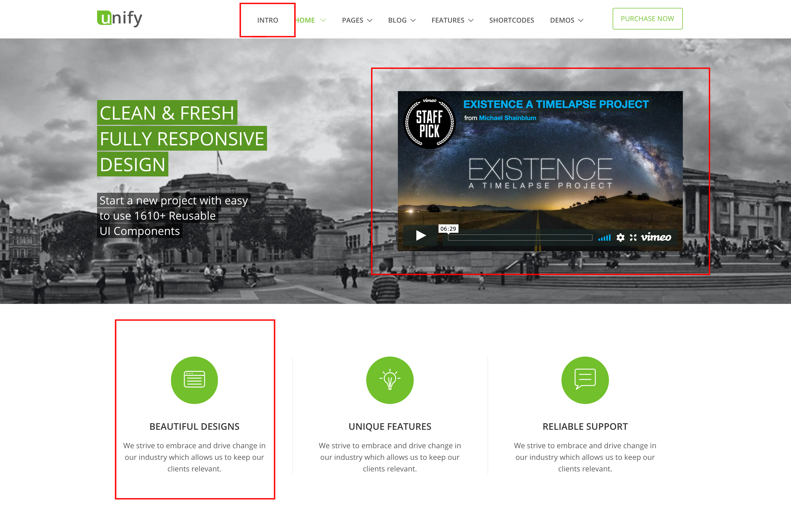
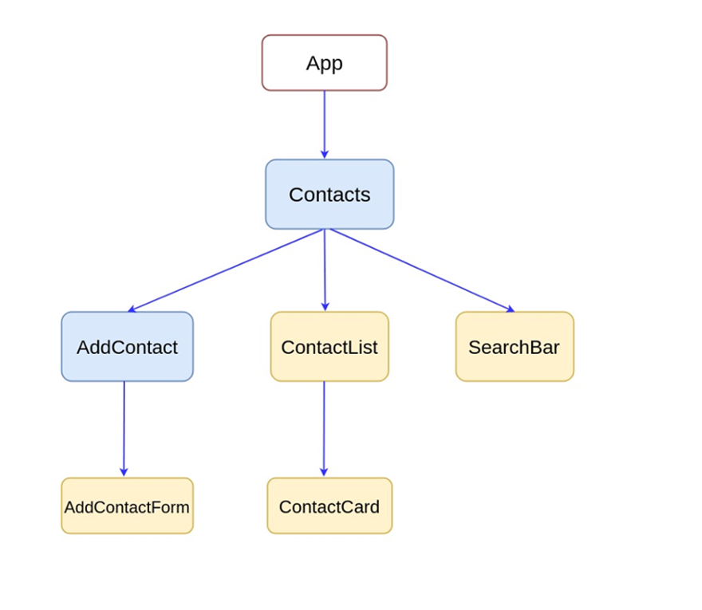

# Reading Material React Week 1

## Agenda

These are the topics for week 1:

1. What is React.js?
   - What React is not
   - Reactive programming
   - Componentization
   - State & Props
   - Lifecycle
2. HTML in JS: JSX
   - What is React and what is not
   - React without JSX
3. Props
   - Unidirectional data flow
4. Deploy a static site
   - What is a static site
   - Static site generators

## 1. What is React.js?

If you go to the official website of [React](https://www.reactjs.org) you'll read the following:

```
A JavaScript library for building user interfaces
```

While completely true, this simple description means quite a lot more to the junior developer. React is a library that allows you to make

### What React is not

The longer you look at React code, the harder it seems to distinguish what exactly is it that makes it "React" code. But in reality there's only `JSX`, predefined functions (like `render` or `useState`) and the idea of `component lifecycle` given to us by the React and ReactDOM libraries.

The rest is "just JavaScript": (higher order) functions, importing/exporting, Promises, event listeners and others.

Study the following to learn more:

- [JavaScript for React Developers](https://www.youtube.com/watch?v=NCwa_xi0Uuc)
- [What to Learn Before a JavaScript Framework](https://www.youtube.com/watch?v=qi9VQqYcXqY)

### Reactive programming

React can be summarized into 3 main concepts: `reactive programming`, `componentization`, `state/props` and `lifecycle`. Let's take a look at the first one: `reactive programming`.

As you've learned in JavaScript3, once you've learned the basic way of programming (procedural) you can start thinking about ways of organizing and structuring your applications.

### Componentization

Just like how we say "in HTML everything is a box" and "in JavaScript everything is an object", the same thing can be said about React. However, on a deeper level you could say that "in React everything is a component".

But what do we mean by `component`? Simply put: it's a part of a website. For example, take a look at the following image:



The sections with a red outline are examples of a component. Why would we want to split our webpage up into components? **We don't want to rewrite the same code**. Instead, we want to be able to **reuse the same code** structurally, and just be able to change the content.

What do we need to think about when deciding something should be a component? We look at **reusability**. A component looks at the commonalities in parts of the page and extracts them into one mold. Then it provides a way for us to give each `component instance` different content.

The navigation bar in the image is made up of 7 instances of the same component, let's call it `NavbarItem`. We make sure we know what the content is of each instance: in this case the names for each page in the website. And then we just pass those values to each instance.

Learn more by going through the following resources:

- [ReactJS Component LifeCycle](https://www.youtube.com/watch?v=3EbYJrAOpUs)
- [Components and Props](https://reactjs.org/docs/components-and-props.html)

### State & Props

What makes React `dynamic` is the concept of `state`. Simply put, state is the data that moves from component to component. It changes based on the input from the user. Let's say a user logs into their Facebook account

- [State and Lifecycle](https://reactjs.org/docs/state-and-lifecycle.html)
- [ReactJS State Tutorial](https://www.youtube.com/watch?v=DPdc5Z-Tf4U)
- [ReactJS Props](https://www.youtube.com/watch?v=eXQRhVUMCP8)

### Lifecycle

If you only build static websites, you are used to pages rendering instantly after they are send to the client. Whether it comes from the server, or you directly open an HTML file by dragging it into your browser, it displays immediately.

This goes differently in React. Every component has a `lifecycle`. Like a human being, you are born, grow up to do certain activities, and ultimately, pass away. The same thing applies here. Only in the case of React components this happens in 3 main phases:

1. Mounting
2. Updating
3. Unmounting

- [React Lifecycle](https://www.w3schools.com/react/react_lifecycle.asp)
- [React Component Lifecycle](https://www.youtube.com/watch?v=m_mtV4YaI8c)

## 2. HTML in JS: JSX

### JSX

Take a look at this code:

```js
const Example = () => {
  return <div>This is an example component</div>;
};
```

- [Introducing JSX](https://reactjs.org/docs/introducing-jsx.html)

### React without JSX

- [React without JSX](https://reactjs.org/docs/react-without-jsx.html)

## 3. Props

### Unidrectional dataflow

As we've learned in previous sections, in React data flows from component to component. However, this goes in an organized, tree-like manner. Take a look at the following diagram:



This is how we should think about creating our components. Here's how it could look in code:

```js
function App() {
  return (
    <Contacts>
      // The Contacts component has 3 children: AddContact, ContactList and
      SearchBar
      <AddContact>
        // This component has 1 child: AddContactForm
        <AddContactForm />
      </AddContact>
      <ContactList>
        // This component has 1 child: ContactCard
        <ContactCard />
      </ContactList>
      // This component has no children, so is therefore self-closing
      <SearchBar />
    </Contacts>
  );
}
```


## 4. Deploy a static site

### What is a static site

A static website is a collection of HTML, CSS and client-side JavaScript files. That's it. It is usually only a frontend, hosted on a web server that only serves the pages the client asks for (for example, `/`, `/about` or `/)

### Static site generators

[React Philosophy](https://reallifeprogramming.com/react-philosophy-e8cdea991599), [Components](https://medium.com/the-andela-way/understanding-react-components-37f841c1f3bb), [JSX](https://reactgo.com/learn-react-jsx-detailed/), [Props](https://www.robinwieruch.de/react-pass-props-to-component/)
