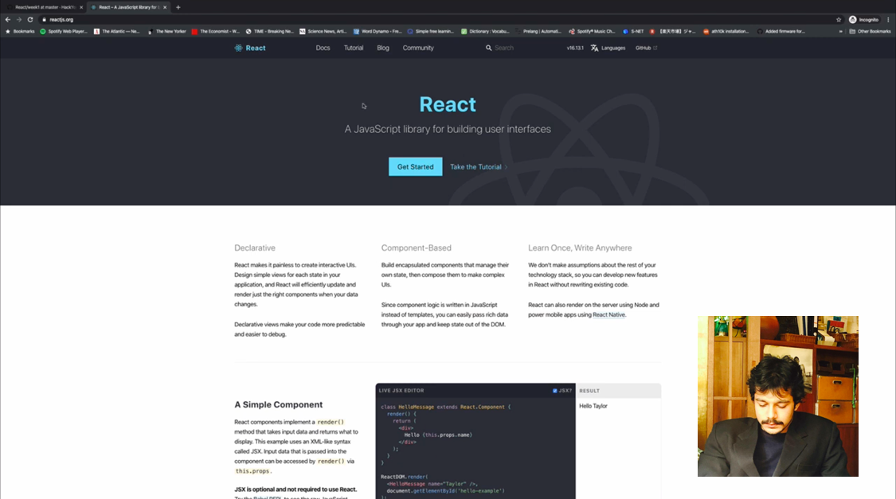

# Reading Material React Week 1

## Agenda

These are the topics for week 1:

1. [What is React.js?](https://study.hackyourfuture.net/#/react/README.md)
   - What React is not
   - Componentization
   - HTML in JS: JSX
2. [State & Props](https://study.hackyourfuture.net/#/react/state-and-props.md)
3. [Hooks](https://study.hackyourfuture.net/#/react/react-hooks.md)
   - **ONLY THE useState and useRef HOOKS**
4. [Forms: Controlled vs Uncontrolled](https://study.hackyourfuture.net/#/react/controlled-vs-uncontrolled.md)
5. [Tools](https://study.hackyourfuture.net/#/react/tools.md)
   - React dev tools
   - `vite` command
   - Static hosting

## Important note on React
> In the React world, there is a huge shift happening since the introduction of 'hooks' in 2018. Before hooks React was built using both class and function components. Currently it is recommended to use only function components in combination with hooks for all of the code you build from now on. When you are researching on your own or when you get into your internship, you will run into class components however. This will be less and less as time goes on and hopefully we can remove this at some point in the future.

> We at HackYourFuture will only be teaching you the recommended way of building applications and have provided a section in the study book to share the most basic details on how to read class components [here](https://study.hackyourfuture.net/#/react/class-vs-function-components.md). If you encounter class components in your research, try to look for a more up to date tutorial, question, or video. If you encounter class components during your internship, then convert it to a function component. The developers will love you :).

## Week Goals

This week we start the wonderful journey of React! Let's start by learning what React is and more importantly what it is not, once you start working with big frameworks like this it becomes hard to identify where the boundary is and we want to make sure you understand where React ends and where JavaScript begins. Have a look at our introduction to React [here](https://study.hackyourfuture.net/#/react/README.md). 

React is a big framework that introduces a lot of new terminology and ways of thinking to simplify the building of bigger applications. Let's start by learning about State and Props [here](https://study.hackyourfuture.net/#/react/state-and-props.md). Now let's go a little deeper into hooks that React gives you to build your application [here](https://study.hackyourfuture.net/#/react/react-hooks.md). For now it is best to focus only on the `useState` and `useRef` hooks as we are just starting out. You can skip the others for now. 

The last thing we want you to have a look at is how to work with user input (as websites will always need to respond to user input). For that we are actually going to go into a discussion about controlled vs uncontrolled components. This is a little broader topic, but forms and user input is the best example for this. Have a look [here](https://study.hackyourfuture.net/#/react/controlled-vs-uncontrolled.md) to try to get a little more into .

Phew, that was a lot, but you now have knowledge of the basic building blocks with which you can already create some very cool applications. But how do you start?

Let's look at some [tools](https://study.hackyourfuture.net/#/react/tools.md) that allows you to start quickly (`vite`) as well as easily deploy anything you build to the web (static hosting).

To bring it all together, you can follow Shriyans in the following video, who employs all of this information to build a small application. You can stop the video at 35 minutes, the assignment has changed since then.

## Finished?

Are you finished with going through the materials? High five! If you feel ready to get practical, click [here](./MAKEME.md).
