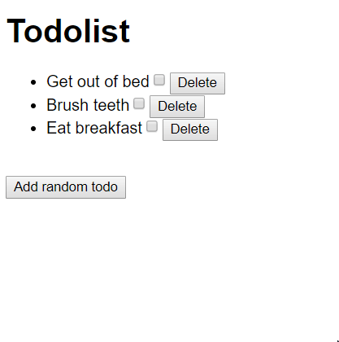

# Homework

## Outline

Extend your todo list app with the ability to add new random todo items. Also your todo list should start rendering todo items using the following array:

```js
const todos = [
  {
    "id": 1,
    "description": "Get out of bed"
  },
  {
    "id": 2,
    "description": "Brush teeth"
  },
  {
    "id": 3,
    "description": "Eat breakfast"
  }
];

```
This also means that new todo items should be added to this array.

Create a checkbox in each todo item. When you click the checkbox, the done state of the item should change. When an item is marked as done, it should be rendered with a `line-through` decoration. A mockup of the end result is the following:

When there are no items, the todo app should render the text "No items...":

## Life cycle
Using life cycles, set up a timer that counts how long time a users has spent on the website. 



Requirements:
- Add random item
- Mark todo item as done
- If no items render "No items"
- *Extra* add a possibility to delete an item

## Reading exercises 

Read about `this` binding in Javascript:
- https://gist.github.com/zcaceres/2a4ac91f9f42ec0ef9cd0d18e4e71262
- https://www.smashingmagazine.com/2014/01/understanding-javascript-function-prototype-bind/
- https://codeburst.io/binding-functions-in-react-b168d2d006cb

Follow the The Beginner's Guide to React by Egghead https://egghead.io/courses/the-beginner-s-guide-to-react

## Hand in Homework:

Watch [this video](https://www.youtube.com/watch?v=feyBVDhFQuk) for a more detailed go-through of how to hand in homework!

- Create a new branch called `react/week2` 
- Add all your changes to this branch in the `react/week2` folder. 
- Go through the [Homework checklist](#homework-checklist)
- Create a pull request using the `react/week2` branch
- Wait for mentor feedback
- Implement feedback, `add`, `commit` and `push` the changes
- Now you can merge the changes into `master`
- When merged you can **share the github link** to your classes slack channel if you are **proud of what you did** 💪
- Now celebrate 🎉🎉🎉

## Homework checklist
Go over your homework one last time:

- [ ] Does every file run without errors and with the correct results?
- [ ] Have you used `const` and `let` and avoided `var`?
- [ ] Do the variable, function and argument names you created follow the [Naming Conventions](https://github.com/HackYourFuture/fundamentals/blob/master/fundamentals/naming_conventions.md)?
- [ ] Is your code well-formatted (see [Code Formatting](https://github.com/HackYourFuture/fundamentals/blob/master/fundamentals/naming_conventions.md))?
