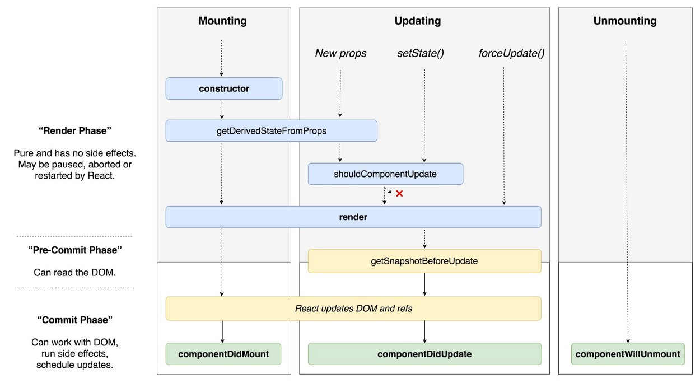

# Lesson Plan - Building components
- Stateful logic - Having logic around state

- Create react app
  - Show students how to install create react app. https://github.com/facebook/create-react-app
  - Explain the general structure
  - How to run `npm run start`
  - Talk briefly about how the dist folder is generated

- Component tree
  - Transform a todolist sketch into components on white board. 
  - *Exercise:* transform another ui into components in pairs.
- stateful logic
  - Using destructuring in React
  - State vs. Props
      - Both props and state trigger a render update when they change
      - How to determine if data should be props or state?
        - Props are "configuration options" for components
        - State is completely optional
        - State increases complexity and reduces predictability
        - Use props unless you definitely need to use state
        - State is single-level only. Components can read and set their own state, but cannot read or set the state of their children
      - Later, we are going to be using a state-management tool
- Using state correctly
    - Do not modify state directly, always use setState
        - Give an example of how mutating state directly doesn’t work
    - State updates are merged (note that merging is shallow)
    - setState is an asynchronously-executed _request_ to change state
- List keys
  - Render list first without adding the key. See the error
  - Assignment of unique key to every item rendered in an array
  - Keys help React identify which items have changed, are added, or are removed
  - [Index should be avoided](https://medium.com/@robinpokorny/index-as-a-key-is-an-anti-pattern-e0349aece318)
  - [Code inspiration](#todolist-updating-state-with-list)
- Lifecycle Methods
  - Full list [here](https://reactjs.org/docs/react-component.html)
    - 
  - Lifecycle methods are used when render is not enough on its own
  - Cover each, giving examples of when they might be useful
    - componentDidMount: data fetching in client-side-only apps
    - shouldComponentUpdate: performance debugging
    - componentWillUnmount: teardown (payment SDKs, intervals, etc)
    - Question: in which of these lifecycle methods is it OK to call setState? (watch out for stack overflows)

[Code inspiration](#counter)

## Code inspiration

### todolist (updating state with list)
https://codesandbox.io/s/simple-todo-list-be9qu

```js
import React, { Component } from "react";
import ReactDOM from "react-dom";

class TodoList extends Component {
  state = {
    todos: [
      {
        text: "asdllll"
      },
      {
        text: "testsss"
      }
    ]
  };

  componentDidMount() {
      console.log('componentDidMount');
  }

  componentDidUpdate() {
      console.log('componentDidMount');   
  }

  componentWillUnmount() {
      console.log('componentWillUnmount');
      
  }

  addTodo = () => {
    const newItem = { text: "lolol" };
    const newList = this.state.todos.concat(newItem);
    this.setState({ todos: newList }, () => {
        console.log('state has been updated');
        
    });
  };

  render() {
      console.log('render');
      
    return (
      <div className="App">
        <button onClick={this.addTodo}>Add todo</button>
        {this.state.todos.map(todo => (
          <li>{todo.text}</li>
        ))}
      </div>
    );
  }
}

const rootElement = document.getElementById("root");
ReactDOM.render(<TodoList />, rootElement);

```

## Exercise

### Counter

First understand the code in this component:

```js
import React from 'react';

class Counter extends React.Component {
  state = { counter: this.props.initialCounter };

  componentDidMount() {
    setInterval(() => {
      this.setState({ counter: this.state.counter + 1 });
    }, 1000);
  }

  render() {
    return <div>
    {this.state.counter}</div>;
  }
}

export default Counter;
```

Now extend it with the following features:
- A button that pauses the counter
  - Clicking it should change the text so it says `start`. Clicking the button now should start the timer again and change the text to `pause`
- Add a button that decrements the timer
- Add a button that resets the counter to 0
