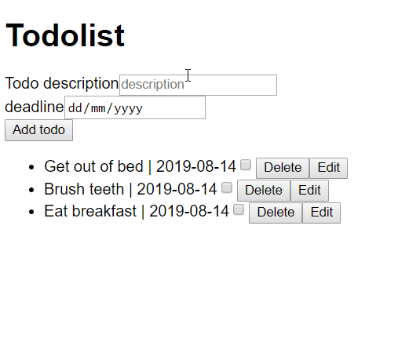

# Homework

Base your week 3 homework on the result of week 2.

- Children

## Outline

Now instead of using an array to load the default items, use the api found here: `https://gist.githubusercontent.com/benna100/391eee7a119b50bd2c5960ab51622532/raw` using `fetch`

Extend your todo list app with the ability to add new todo items with user inputted data and remove existing ones and a deadline for the todo item.

Create an add button, a text input and a deadline input. When the add button is clicked a new todo item is created with the given
description and deadline. Create also a remove button, which when clicked it should remove the todo item from the list.

> Challenge: figure out a way for users to enter the deadline date. This is a great opportunity to think like a community in a wider development community. Perhaps there are some **react** libraries out there that provide some kind of **date picker**? Also, look at **momentjs** to see if it could be useful.

Create a component that wraps another component in a black border using [react children](https://medium.com/javascript-in-plain-english/how-to-use-props-children-in-react-7d6ab5836c9d)

Demo of how the homework should look

Here are the requirements for this weeks homework:
- Add a deadline to the todo item
- Create new item using description and deadline that the user inputs
- Possibility to update a todoitem
- Create proptypes for at least one of the components
- Create a border component that wraps a component in a black border

Worth considering:
- What if the description input is empty?
- What if the deadline input is empty?
- What if the deadline is before the current day?
- What if you edit an item with an empty description?

## Extra assignment

Make the exercises in [chat-app](/documentation/chat-app/Exercises.md)!