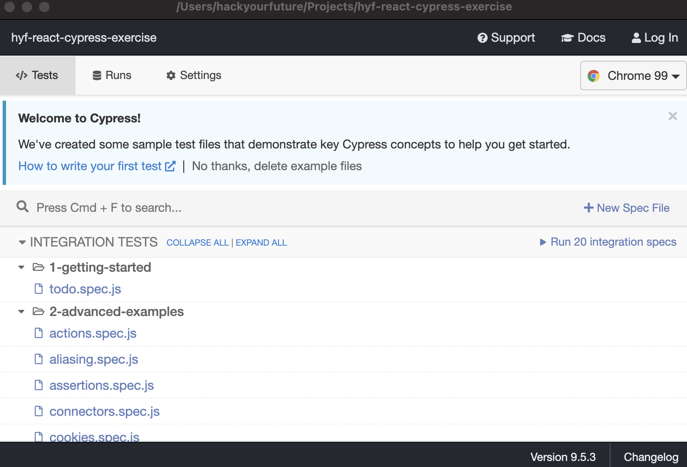

# End-to-end testing

As mentioned in the reading materials, end-to-end testing is becoming more and more popular as it is as close to testing the user experience as you can get. Where in the past the theory was to test every component separately to identify errors early in development, with the current technologies testing end-to-end is becoming fast enough to be able to identify issues early on as well.

In this exercise we will look at the end-to-end testing tool [Cypress](https://www.cypress.io/) which is a popular framework because it does a lot while still being relatively easy to learn. So perfect for beginners to try out!

## Setting up

So let's get started! We will guide you through the steps to set up cypress in a separate repository.

1. Create a new github repository, name it something like `cypress-playground` as we are just going to play around with it here.

Now let's follow the installation guide as mentioned [here](https://docs.cypress.io/guides/getting-started/installing-cypress):

2. Clone it locally and write `npm install cypress --save-dev` to install the cypress package. Note that you do _not_ have to do anything with React in this exercise, end-to-end testing is completely independent from any implementation details.
3. After installing the package we can run cypress using `npx cypress open`.

This does a lot! You will now see that a `cypress` folder was added to your file system. There is also a `cypress.json` file that contains some configuration (or usually empty to start). And by opening cypress you also have a window that looks a bit like this:

Cypress has added a lot of sample tests for you that connect to their deployed applications and show off all the things you can do with it. Go ahead and click on some of the tests to see why everyone gets really excited about end-to-end testing. You can pretty much programmatically write down all of those tests that you usually do manually to check that a certain user flow still works after every change you make!

All of these tests are inside of the `cypress` folder that was added to your project. If you look into the `cypress/integration` folder you will see all of the code that generates the tests inside cypress.

## Get started!

Now for the fun part, playing around ourselves!

1. In this folder you will find a folder called `0-myown`. Copy this over to your project inside of the `cypress/integration` folder so that it is next to the cypress examples. We start with `0-` to make ours nicely at the top of the list :D!
2. Go through those files, we numbered them so that you know where to start, the extra explanations get less and less as you go on. _Note: The API we use is sometimes a little slow with responses and can cause timeout issues. If you get these, have a look at the cypress documentation to figure out how to increase the time cypress will wait per command._
3. Fill in the tests that are missing!

## Things to think about

- The API we use has a stable data set. How would you test a data set that is not this stable? What would you need to change in these tests?
- It is possible to [add your own commands](https://docs.cypress.io/api/cypress-api/custom-commands) to cypress, are there things in the code you think should be made a custom command?
