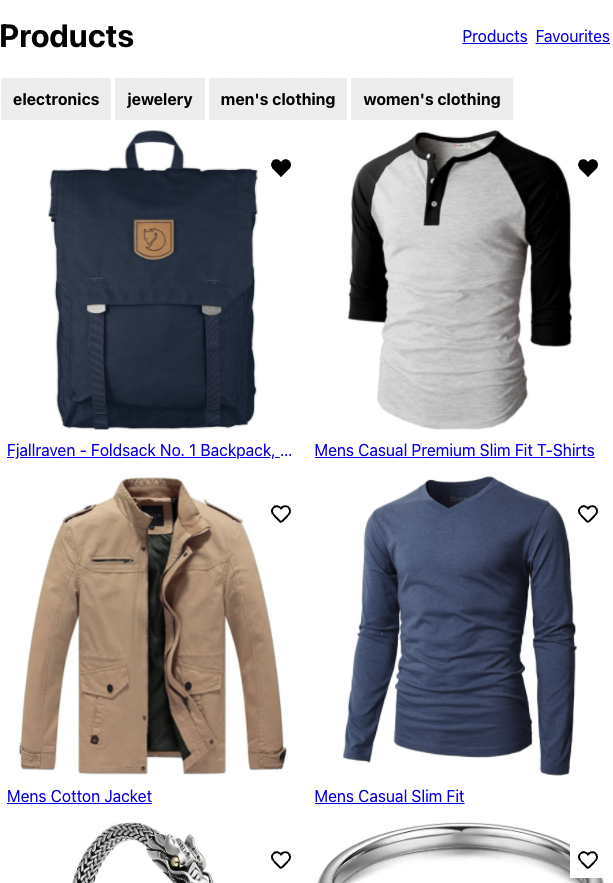

# Ecommerce Project III

## 1. Setup

Make sure you created a new week3 branch from the `main` branch of your forked repo. Then copy over the `ecommerce` folder you made last week into the `week3/project` folder.

Copy over the `assets` folder to your `ecommerce/src` folder. We will use these svg files for our favourites functionality.

## 2. Requirements

We are going to implement some cool new features this week now that we have all of the React building blocks at our disposal. By the end of the assignment your application should work similar to this:

There is a live version [here](https://hyf-react-w3-example.netlify.app)

What you need to have done at the end of the week:

- There should be a context that stores the `id` of all of the favourites of the user. You should not store the whole object!
- For the images in the product list as well as the product details page there needs to be a heart that if clicked will update the favourites array in the context. The heart should show the right svg file depending if it is favourited or not.
- Your app should have a favourites page to list all of the products the user has favourited. You will need to perform multiple fetches as you only have the `id` of the favourites.
  > Storing the whole object would make this easier of course and in this example would probably be a better solution, but we want to challenge you a bit by adding a multiple fetch scenario.
- Add a navigation bar at the top that handles routing between `/` and `/favourites`. The `/favourites` route should go the favourites page.
- If you did the same things as us then in the Products and ProductDetails pages you will have quite a lot of duplicate logic concerning the `loading` and `error` states of all those requests. Fix that by creating a `useFetch` custom hook.
  > Your custom hook will have a couple of challenges. The URL for the products changes and you will have to perform that fetch whenever the user clicks a category so you will need to give the user of your hook the option to do that.
  > Extra challenge: We purposefully do not say Favourites page here as that would make the custom hook even more difficult to build. If you are up for the challenge, add functionality to your hook for multiple fetches!
- You need to deploy your app somewhere (using something like [netlify](https://www.netlify.com)) and put the link in your PR! Make it a different one than the previous week.
