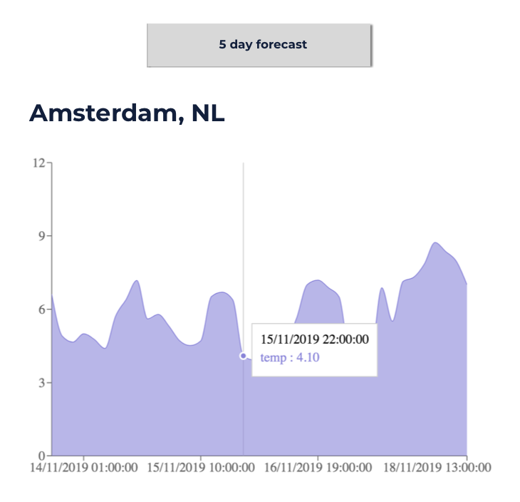

# Homework React Week 4

## **Todo list**

1. Practice the concepts
2. React exercises
3. Code along
4. PROJECT: Hack Your Weather IIII

## **1. Practice the concepts**

Let's finish the online exercises. Start from `Review Using Props with Stateless Functional Components` until the last exercise `Render React on the Server with renderToString`:

- [FreeCodeCamp: Exercise 21-48](https://www.freecodecamp.org/learn/front-end-libraries/react/)

## **2. React exercises**

**No exercises this week**

## **3. Code along**


- [Build a Movie Database](https://www.youtube.com/playlist?list=PL_kAgwZgMfWyZ6m8fDwdiwEarr_g6nFxz)

## **4. PROJECT: Hack Your Weather IV**

> Make sure you're building on last week's codebase.

This week we'll finish our application by integrating 2 things: `client-side routing` with [React-Router-Dom](https://reacttraining.com/react-router/web/guides/quick-start) and `charting` our data (in either hourly or five day forecasts).

### 1. Setup

1. Install the following packages: [React Router Dom](https://www.npmjs.com/package/react-router-dom) and [Recharts](https://www.npmjs.com/package/recharts)

```
npm install react-router-dom recharts
```

### 2. Requirements

At the end of the week the user interface of your application will look mostly the same, but with an additional page:



Here are the requirements your project needs to fulfill:

- Divide your page into 2 different routes (`/` and `/:cityId`), using `react-router-dom`
- Allow users to click on the searched city to open the city page
- The city page will be on a different route identified by the city id (make use of the `<Link>` component given by `react-router-dom`)
- On the city page there will be several things:
  - Two tabs, one for the hourly forecast and the other for a 5 day forecast
  - A chart (made with `recharts`) that displays the correct data according to which tab is active
- Clicking on a tab will do 2 things: (1) make an API call to get the right data (using the city id from the URL params), and (2) switch the active component (from the hourly forecast to the five day forecast and vice versa)
- Add a "Back" button to go back to `/`, on the city page
- Redeploy your site

Hints:

- Read the documentation to get a basic sense of what problems both `react-router-dom` and `recharts` are trying to solve, and to learn how to use them
- Make sure to have a clear overview of your application so far, before you add this week's features to it

## **SUBMIT YOUR HOMEWORK!**

After you've finished your list it's time to show us what you got! Upload all your files to a forked repository (a copy from the original, which in this case is the [React](https://www.github.com/HackYourFuture/React) repository) using GIT. Then make a pull request to your teacher's forked repository.

If you need a refresher, take a look at the following [guide](../hand-in-homework-guide.md) to see how it's done.

The homework that needs to be submitted is the following:

1. Project: Hack Your Weather IV

_Deadline Saturday 23.59 CET_
